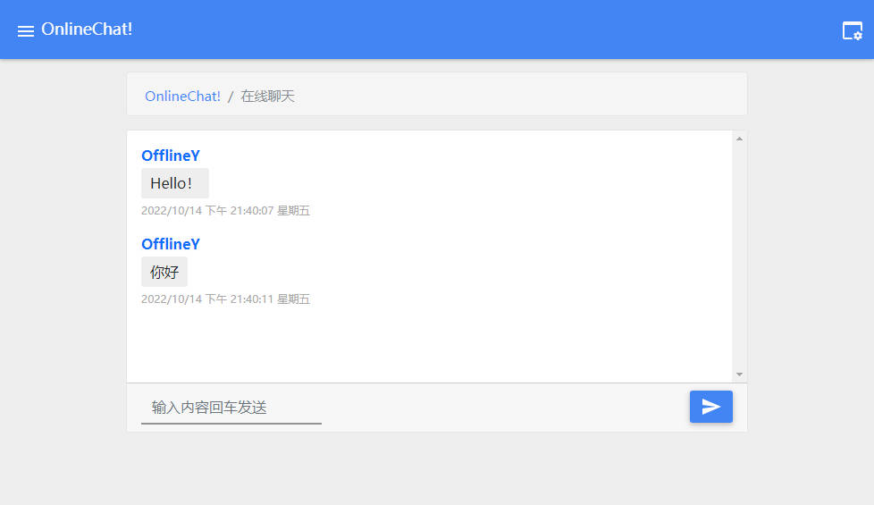

<div align="center">

# 📫OnlineChat
✨ 使用 golang 实现的简单聊天示例 ✨

</div>


## 🎈 使用

> 方式一：下载[https://github.com/OfflineY/OnlineChat/releases](https://github.com/OfflineY/OnlineChat/releases)内的版本解压运行即可。

> 方式二：克隆此仓库运行
>
> ```shell
> go run main.go
> ```

如果没有配置文件会自动初始化，初始化完成之后重启应用即可。

具体设置配置文件内写的很清楚。

## 📝 TODO

- [ ] ~~服务端命令式控制~~（已取消）

- [x] 增加版本更新检测

- [ ] 用户在线列表

- [ ] sqlite3数据库支持

- [ ] ~~使用gin和react构建web端~~（已取消）

- [x] 使用gin构建web端

  > 为什么不用react？因为我 ~~懒~~ 能力不足

## 🚀 从 1.x 到 2.x

- 增加了web端

- 错误提示与处理方案

- golang 升级 1.19

## 🖼截图



▲ 2.0.0 beta 1 版本

## 🎡 技术栈

- Golang v1.19
- github.com/gin-gonic/gin v1.8.1
- github.com/gorilla/websocket v1.5.0
- gopkg.in/ini.v1 v1.67.0
- gorm.io/gorm v1.24.0


> 已开学，将无时间维护
